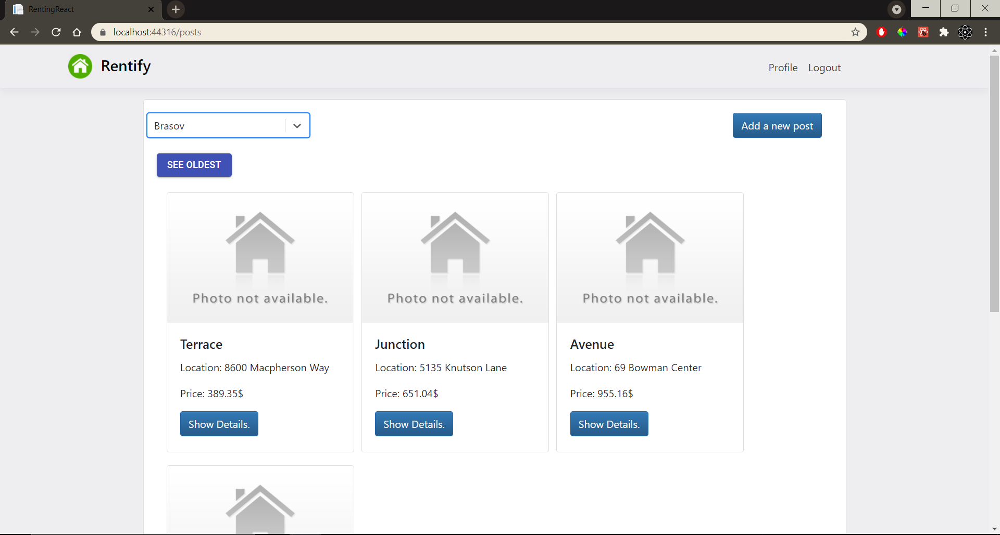

# Rentify 

## About the project

Rentify is a online apartment/house listing website. 

The purpose of the app is to make the process of searching for rent or a renter as easy as possible.

Once entering the user is welcomed by the home page:

A user can register on the website

Or he can login if he already has an account:

There is a posts page that shows the user all the renting posts made.
The posts can be filtered by city and sorted by the date they were added:

If the user is logged in, he can make his own post:

After the post was made, the user click on the show details button on the post card to be redirected to the post page.
There the user can add photos for the post or edit the details.

Each user has it's own profile page, where other users can see the user details and all the posts he made:

If a user introduces a wrong route path in the browser, he will be redirected to a NotFound page:

Lastly, here is the swagger implementation with some of the routes:

## Technologies used

For Backend:

- C# Asp.Net Core
- SQL
- Identity Server
- Entity Framework
- Swagger

For Frontend:

- React Js
- Html/Css
- Bootstrap

## To run this project

- Clone this repository
- Set RentingApi and RentingReact projects as startup projects 
- Run